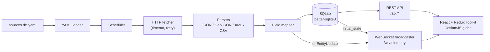

# MK-OSINT

A real-time 3D OSINT globe, plus the workshop kit for building one with an AI coding agent.

<p align="left">
  
  
  
  
  
</p>

<p align="center" width="100%">
  <video src="https://github.com/user-attachments/assets/22111890-6e4a-4d7b-9ca4-9d4cad79ccd5" width="80%" controls></video>
</p>

## What it is

This repo contains two things:

1. **A working platform.** A CesiumJS globe that streams public OSINT feeds (flights, the ISS,
   earthquakes, radiation, ATC facilities) over WebSocket from an Express/SQLite backend. Each
   data source is a single YAML file in `sources.d/`.
2. **A workshop kit.** Prompts, example specs and plans, and an agent skill that walk you from an
   empty folder to that same platform by directing an AI coding agent (Claude Code, Codex, or
   similar) through spec-driven development.

If you just want to run or extend the globe, start at [Quick start](#quick-start). If you are here
for the workshop, jump to [The workshop](#the-workshop).

## Features

- Full-screen 3D globe (CesiumJS) with six switchable globe styles: Tactical Dark, Blue Marble,
  Night Lights, Neon Vector, Terrain Relief, Holographic.
- Live entities pushed over WebSocket (`/ws/telemetry`): an `initial_state` snapshot on connect,
  then `entity_update` frames as the ingestion engine fetches new data.
- Declarative ingestion engine: HTTP polling with timeouts and retry/backoff, JSON, GeoJSON, XML,
  and CSV parsers, a path-based field mapper, record filters, and `append` or `upsert` recording.
- REST API with an OpenAPI 3.0 spec (served at `/api/openapi.yaml`): `/api/health`,
  `/api/sources`, `/api/entities`, `/api/observations`. Paginated responses carry the full match
  count in `total`, and unknown routes return a JSON 404.
- Layer controls, an entity details drawer, a telemetry stats banner, and an FPS / level-of-detail
  HUD.
- Cinematic overlays: CRT, Night Vision, FLIR thermal.
- Five sources enabled out of the box, and 19 more validated, no-auth source definitions ready to
  drop in.

## Quick start

**Prerequisites:** Node.js 22.22.2+ and npm.

```bash
make install   # npm install for root + backend + frontend workspaces
make dev       # backend on :4000, frontend on :3000
```

Open <http://localhost:3000>. The Vite dev server proxies `/api` and `/ws` to the backend on
port 4000, so there is nothing else to configure.

**Or with Docker** (one container serves the UI, API and WebSocket on port 4000):

```bash
make docker-up     # docker compose up -d --build
# open http://localhost:4000
make docker-down
```

Data lives in the `mk-osint-data` volume, `./sources.d` is mounted read-only, and
`backend/.env` is loaded if present. See [docs/development.md](docs/development.md#deployment).

Other targets:

```bash
make test      # Jest (backend) + Vitest (frontend)
make build     # tsc for the backend, tsc + vite build for the frontend
make lint      # type-check both workspaces
make format    # Prettier over the repo
npm run format:check   # Prettier check (run in CI)
make help      # list all targets
```

### Configuration

The backend reads environment variables (via `dotenv`). Copy `backend/.env.example` to
`backend/.env` and adjust as needed (dotenv reads from the backend's working directory). All of them are optional.

| Variable | Default | Purpose |
| :-- | :-- | :-- |
| `PORT` | `4000` | HTTP and WebSocket port for the backend |
| `SOURCES_DIR` | `<repo>/sources.d` | Directory the engine loads source YAML files from |
| `DB_PATH` | `mk-osint.db` | SQLite database file, relative to the backend working directory |
| `INGEST_ENABLED` | `true` | Set to `false` to register sources without polling them |
| `MKOSINT_CESIUM_ION_TOKEN` | unset | Cesium ion token, served to the browser via `/config.json` |
| `MKOSINT_DEFAULT_GLOBE_STYLE` | `tactical` | Initial globe style, served via `/config.json` |
| `MKOSINT_SERVE_FRONTEND` | auto | `true` makes the backend serve `frontend/dist` (on by default when `NODE_ENV=production`) |

If you change `PORT`, update the proxy targets in `frontend/vite.config.ts` to match.

## Architecture



Express and the WebSocket server share one HTTP listener. When the scheduler writes an entity it
calls `onEntityUpdate`, which the broadcaster fans out to every connected client. The frontend
gets sources and entities from the socket (`initial_state`, then `entity_update`) and loads an
entity's observation history over REST (RTK Query). REST and WebSocket payloads share one wire
format: `metadata` and `raw_payload` are objects and `enabled` is a boolean.

More detail: [docs/architecture.md](docs/architecture.md) and [docs/api.md](docs/api.md).

## Project structure

```
.
├── backend/                    Express + TypeScript API, ingestion engine, WebSocket server
│   └── src/
│       ├── api/                routes, errors, openapi.yaml
│       ├── db/                 SQLite schema and queries
│       ├── engine/             yaml-loader, scheduler, http-fetcher, field-mapper, parsers/
│       ├── websocket/          server and broadcaster
│       └── __tests__/          Jest suites
├── frontend/                   Vite + React 18 + MUI + CesiumJS
│   └── src/
│       ├── components/         GlobeView, drawers, selectors, filters/ (CRT, NV, FLIR)
│       ├── hooks/              useWebSocket
│       └── store/              Redux Toolkit slices + RTK Query API
├── sources.d/                  active source definitions (one YAML per feed)
├── analysis.d/                 AI analyses (scheduled LLM prompts; off until an API key is set)
├── skills/onboard-source/      agent skill: URL in, source YAML out, plus 19 examples
├── docs/
│   ├── README.md               docs index
│   ├── architecture.md
│   ├── api.md
│   ├── data-sources.md
│   ├── development.md
│   └── workshop/
│       ├── README.md           full workshop guide
│       ├── prompts/            PROMPT_1..6 build prompts
│       ├── examples/
│       │   ├── specs/          reference specs
│       │   └── plans/          reference plans
│       └── whitepaper.pdf
├── tools/
│   └── tactical-icon-preview.html
├── .github/workflows/ci.yml
├── AGENTS.md · CLAUDE.md · RTK.md   agent context and conventions
└── Makefile
```

## Adding a data source

Drop a YAML file into `sources.d/` and restart the backend. No engine changes needed.

```yaml
schema_version: 1
name: usgs_earthquakes
source_type: usgs_earthquakes
layer_type: earthquakes
display_name: 'USGS Earthquakes'
enabled: true

transport:
  type: http_poll
  url: 'https://earthquake.usgs.gov/earthquakes/feed/v1.0/summary/all_hour.geojson'
  interval: '60s'

parser: { format: geojson, records_path: 'features' }

entity:
  external_id: 'id'
  name: 'properties.place'
  category: 'geological'

observation:
  latitude: 'geometry.coordinates[1]'
  longitude: 'geometry.coordinates[0]'
  timestamp: 'properties.time'

recording: { mode: upsert }
```

`category` must be one of `satellite`, `aircraft`, `geological`, `radiation`, `maritime`, or
`atc_zone`. The full schema (headers, retries, filters, metadata mapping, unit scaling) is in
[docs/data-sources.md](docs/data-sources.md).

To generate one from a URL, point your agent at
[skills/onboard-source/SKILL.md](skills/onboard-source/SKILL.md). It inspects the response and
writes a valid definition. `skills/onboard-source/examples/` has 19 ready-made ones covering
flights, ships and ports, satellites and launches, earthquakes, volcanoes, wildfires, radiation,
nuclear and power infrastructure.

## The workshop

The kit teaches spec-driven development with the [Superpowers](https://github.com/obra/superpowers)
skill set. Nothing gets coded until the design is written down and reviewed:

```
PROMPT  ->  SPEC  ->  PLAN  ->  SUBAGENT-DRIVEN BUILD
           (review)  (review)
```

There are two ways through it:

- **Path A, full spec-driven (recommended).** Run `docs/workshop/prompts/PROMPT_N_*.md` in your
  agent. It writes a spec and a plan, you review both, then it executes the plan with subagents.
- **Path B, token-saver.** Skip generation and hand the agent a ready plan, for example:
  *"Use a subagent-driven approach to execute
  `docs/workshop/examples/plans/01-project-setup-plan.md`."*

Either way, validate after every step: open <http://localhost:3000>, try what was built, and tell
the agent to fix bugs or move on.

| # | Step | Produces |
| :-- | :-- | :-- |
| 1 | Project setup | Makefile, Express + SQLite + OpenAPI backend, Vite/React/MUI frontend with a basic Cesium globe |
| 2 | Ingestion engine | YAML loader, HTTP fetcher, JSON/GeoJSON/XML/CSV parsers, field mapper, scheduler |
| 3 | Backend WebSocket API | Real-time telemetry push |
| 4 | Frontend globe dashboard | Live markers, layer controls, entity inspector, telemetry HUD |
| 5 | Cinematic filters and polish | CRT, Night Vision, FLIR overlays |
| 6 | Integration and debug | End-to-end wiring, visual verification, bug fixes |

The code in `backend/` and `frontend/` is what a finished run looks like, so you can compare your
result against it. The full guide (150-minute outline, prompt-writing template, tips for
token-limited accounts) is in [docs/workshop/README.md](docs/workshop/README.md).

## Recommended tooling

The tested set. All of it is swappable.

| Tool | Role | Link |
| :-- | :-- | :-- |
| **Superpowers** | Spec-driven workflow: brainstorming, spec/plan writing, subagent execution, verification | https://github.com/obra/superpowers |
| **Context7** | Pulls current library/framework docs into context on demand | https://github.com/upstash/context7 |
| **RTK** (Rust Token Killer) | Compresses noisy command output (builds, tests, git) by 60-90% | https://github.com/rtk-ai/rtk |
| **Engram** | Persistent agent memory across sessions | https://github.com/Gentleman-Programming/engram |
| **Chrome DevTools MCP** | Lets the agent drive a real browser to visually verify the UI | https://github.com/ChromeDevTools/chrome-devtools-mcp |

Optional token/context helpers (pick one, not both):
[Ponytail](https://github.com/DietrichGebert/ponytail) or
[Caveman](https://github.com/juliusbrussee/caveman).

A monthly subscription is usually cheaper than pay-per-token APIs for heavy interactive use. If you
are token-limited, use Path B and lean on RTK and Engram.

## Contributing

Issues and pull requests are welcome. See [CONTRIBUTING.md](CONTRIBUTING.md) for setup, checks, and
conventions, and [docs/development.md](docs/development.md) for the development workflow.

## Credits

The original workshop was created by [Alevsk](https://github.com/Alevsk); this repo is a fork of
[Alevsk/vibe-coding-osint-platform](https://github.com/Alevsk/vibe-coding-osint-platform). It is a
simplified, workshop-sized take on a real geospatial intelligence platform, with a stack you can
build in an afternoon alongside an AI agent.
