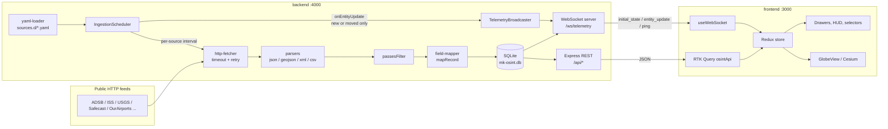

# Architecture

The platform is an NPM-workspaces monorepo with two packages and one data directory:

| Path | Role |
| :-- | :-- |
| `backend/` | Node.js + Express + TypeScript. Loads YAML source definitions, polls public feeds, writes to SQLite, serves a REST API and pushes live updates over WebSocket. |
| `frontend/` | Vite + React 18 + Redux Toolkit (with RTK Query) + MUI + CesiumJS. Renders the 3D globe, layer controls, entity inspector, HUD, cinematic filters and globe styles. |
| `sources.d/` | Declarative YAML source definitions, one file per feed. See [data-sources.md](data-sources.md). |

The backend runs on port 4000 and the Vite dev server on port 3000. In development, Vite proxies `/api` and `/ws` to the backend, so the browser only ever talks to port 3000. See [development.md](development.md).

## Data flow



At startup `backend/src/index.ts`:

1. Loads `.env` with `dotenv`.
2. Opens the database with `initDatabase(DB_PATH)`.
3. Builds the Express app (`createApp`) and a single `http.Server` for it.
4. Attaches the WebSocket server to the same HTTP server on `/ws/telemetry`.
5. Creates an `IngestionScheduler` and wires `scheduler.onEntityUpdate` to `broadcaster.broadcastEntityUpdate`.
6. Starts listening. If `INGEST_ENABLED=false`, it only registers sources (`initSources()`); otherwise it calls `scheduler.start()`.

`SIGINT` and `SIGTERM` stop the scheduler, terminate open sockets, close the HTTP server and then the database.

## Ingestion pipeline

All code lives in `backend/src/engine/`.

### yaml-loader (`yaml-loader.ts`)

`loadSourcesFromDir(dir)` reads every `*.yaml` / `*.yml` file in the directory in sorted order and parses it with the `yaml` package. Each parsed file goes through `validateSourceConfig()`, which returns every problem it finds: a missing or empty `name`, `source_type`, `transport.type`, `transport.url`, `parser.format`, `entity.external_id`, `observation.latitude` or `observation.longitude`; a `schema_version` other than `1` (`SUPPORTED_SCHEMA_VERSIONS`; absent means 1); a `transport.retry.backoff` outside `exponential`, `linear`, `fixed`; or an `observation.scale` entry that is not one of `SCALABLE_OBSERVATION_FIELDS` or not a finite number; a `parser.format` outside `PARSER_FORMATS`, malformed `parser.csv` / `array_columns`, a `recording.mode` outside `RECORDING_MODES`, an unparseable `recording.max_age`, a filter rule with neither `field` nor `expr`, or an expression with a syntax error. `lookups:` file tables are then loaded by `resolveLookups()`; a failure there also skips the file. Invalid files are logged as `Skipping invalid source definition <path>: <problems>` and unparseable files are logged too; both are skipped and never abort the load.

The file also defines the canonical category list, `ENTITY_CATEGORIES`:

```
satellite, aircraft, geological, radiation, maritime, atc_zone
```

A source with a different `entity.category` still loads, but a warning is logged because the frontend has no marker for it.

`parseDurationSeconds()` turns interval and timeout strings (`"30s"`, `"5m"`, `"1h"`, `"500ms"`, or a bare number of seconds) into whole seconds.

The full schema is documented in [data-sources.md](data-sources.md).

### scheduler (`scheduler.ts`)

`IngestionScheduler` owns the polling loop.

- `initSources()` loads the configs and upserts one row per source into the `sources` table (`id` = `name`, `name` = `display_name`, `type` = `source_type`, `transport` = `transport.type`, `update_interval_sec` = parsed interval, `enabled` = 0 or 1). If a row cannot be written, the error is logged and that source is dropped from the configs (never polled) instead of aborting startup.
- `start()` calls `initSources()`, then for each source that is not `enabled: false` polls once immediately and again every `transport.interval` (default 60 seconds) with `setInterval`.
- `pollSource(config)` runs one fetch, parse, filter, map and persist cycle inside a single SQLite transaction and returns the number of records written. Errors are logged with the source name and the method returns 0, so one failing feed never stops the others. Counters for the poll (`written`, `skipped`, `filtered`, `unlocated`, `duplicates`, `stale`) are kept in `lastStats`.
- For orbital formats (`tle`, `omm_json`) the parsed element sets are cached per source and propagated to "now" before mapping. `repropagate(config)` re-propagates the cached sets without fetching; `start()` schedules it every `transport.propagate_interval`.

Within a poll:

1. Each raw record is checked against the source's `filter` rules. Excluded records are counted separately from malformed ones.
2. `mapRecord` turns the record into an entity and an observation. Records without an id or valid coordinates are skipped, never plotted at (0, 0).
3. The entity row is upserted by its prefixed id (`<source name>:<external_id>`).
4. The observation is written according to `recording.mode` (default `append`):
   - `upsert`: one observation per entity (`obs_<entity id>`), updated in place.
   - `append`: `INSERT OR IGNORE`, so repeat polls of the same instant are no-ops. After the transaction, each touched entity is pruned to its newest 200 observations (`MAX_OBS_PER_ENTITY`).
5. The scheduler keeps the last `latitude,longitude,altitude` it saw for every entity id in memory. Only entities that are new or whose position changed are collected for broadcast.

After the transaction commits, `onEntityUpdate` is called for each changed entity.

### http-fetcher (`http-fetcher.ts`)

`fetchUrl()` uses the global `fetch` with an `AbortController` timeout. It sends `User-Agent: MK-OSINT/1.0` plus any configured headers, treats any non-2xx status as a failure, and returns the body as text. Failed attempts are retried after `retryDelayMs(attempt, backoff, initialDelayMs, maxDelayMs)`: `exponential` (`initialDelayMs * 2^(attempt-1)`), `linear` (`initialDelayMs * attempt`) or `fixed` (`initialDelayMs`), always capped at `maxDelayMs`. After the last attempt it throws the last error.

### retry (`retry.ts`)

`retry.ts` holds `BACKOFF_STRATEGIES`, `retryDelayMs()` and `DEFAULT_RETRY`, the single default retry policy: 3 attempts, 1 second initial delay, 15 second cap, exponential backoff. Both `fetchUrl()` and the scheduler fall back to it, so there is no second set of defaults. The scheduler passes these values from the YAML: `timeout` (default 10s), `retry.max_attempts`, `retry.initial_delay`, `retry.max_delay` and `retry.backoff`, each defaulting to `DEFAULT_RETRY`.

### parsers (`parsers/`)

`parsePayload(content, format, recordsPath, maxRecords, options)` dispatches on `parser.format` and then truncates to `max_records` if set. `options` is the source's `parser` block (`csv`, `object_to_records`, `key_field`, `array_columns`).

| Format | Implementation | Behaviour |
| :-- | :-- | :-- |
| `json` | `JSON.parse` | Walks `records_path` (dot notation). A top-level array is used as-is; an object is wrapped as a single record (for example, the ISS endpoint). |
| `geojson` | `JSON.parse` | Same, but `records_path` defaults to `features`. |
| `xml` | `fast-xml-parser` with `ignoreAttributes: false` | Walks `records_path` to the repeated element (for example `rss.channel.item`). A single element is wrapped into a one-element array. |
| `csv` | `papaparse` with `header: true`, `skipEmptyLines: true` | The header row becomes the record keys. Values stay strings and are coerced later by the mapper. With `parser.csv`, lines are pre-filtered (`skip_lines`, `comment_prefix`), split by the given delimiter or on whitespace, and keyed by the header, `columns` or `c0..cN`. |
| `json` reshaping | `reshapeJson()` in `json-parser.ts` | `object_to_records` turns an object map into records (key in `key_field`, default `_key`); `array_columns` zips array rows with a column list or a header row. |
| `rss` | `rss-parser.ts`, `fast-xml-parser` | Finds RSS 2.0 / RDF / Atom items and normalizes them to `{title, link, description, published, guid, categories, author, lat, lon}` (GeoRSS simple, GML and W3C geo). |
| `tle` | `tle-parser.ts` | 3-line and 2-line element sets to element records carrying `line1`/`line2`. |
| `omm_json` | `tle-parser.ts` | CelesTrak GP JSON; `ommToTle()` synthesizes canonical TLE lines (with checksums) so both formats share one SGP4 path. |

### orbit (`orbit.ts`)

`propagateRecords(records, date)` runs SGP4 (`satellite.js` v5, the last CommonJS release) on each element record and adds `lat`, `lon`, `alt` (m), `speed` (ECI speed, m/s), `heading` (bearing of the ground track over the next second) and `timestamp`. Parsed `satrec`s are cached in a `WeakMap` keyed by the element record, so re-propagation ticks only pay for the propagation. Sets that SGP4 rejects (decayed, malformed) are dropped.

### expressions (`expressions.ts`), lookups (`lookups.ts`), dedupe (`dedupe.ts`)

- `expressions.ts` is a tokenizer, Pratt parser and tree-walking evaluator for `=expr` mapping values and `filter[].expr`. There is no `eval`/`Function`; identifiers read only own properties of the record (never `__proto__`, `constructor` or `prototype`), and calls resolve only to a fixed helper table. Compiled expressions are cached by source text. `collectExpressionErrors()` is called by `validateSourceConfig()`, so syntax errors reject the file at load.
- `lookups.ts` resolves the top-level `lookups:` block (inline maps, or `.json`/`.csv` files confined to the sources directory) once at load.
- `dedupe.ts` computes the `recording.mode: dedupe` identity: sha256 over a key-sorted JSON of `dedupe_fields` values, or of the mapped entity.

### field-mapper (`field-mapper.ts`)

- `resolvePath(obj, path)` resolves dot and bracket paths such as `geometry.coordinates[1]`.
- `resolveValue(obj, expr)` tries the expression as a path first. If that yields nothing and the expression is a numeric string, it returns the number as a literal, which is why `altitude: '0'` gives 0.
- `passesFilter(raw, rules)` evaluates the `filter` list (`in` and `not_empty`).
- `computeDerived(raw, derived)` builds computed metadata from `map` lookups, `{path}` templates or plain copies.
- `mapRecord(raw, config, sourceId)` produces the `EntityRecord` and `ObservationRecord`. The entity id is `<sourceId>:<external_id>`, so feeds that reuse an external id never collide. Latitude, longitude, altitude, speed and heading are multiplied by any `observation.scale` factor; altitude is stored in metres. It normalizes timestamps (epoch seconds, epoch milliseconds or anything `Date.parse` accepts) to ISO 8601, falling back to ingest time. It also builds a deterministic observation id, which is the basis of deduplication:
  - `upsert`: `obs_<entity id>`
  - `append` with a source timestamp: `obs_<entity id>_<epoch_ms>`
  - `append` without a source timestamp: `obs_<entity id>_<lat.toFixed(4)>_<lon.toFixed(4)>`, so a stationary target does not create a new row on every poll.
  - `dedupe`: `obs_<entity id>_<sha256>`. The scheduler skips a record whose id already exists (before touching the entity), otherwise upserts the entity and inserts the observation, replacing a row with the same `(entity_id, timestamp)`.
- `resolveValue(obj, expr, ctx)` evaluates values starting with `=` as expressions; `expressionContext(config)` supplies the lookup tables. `isUnlocated(raw, config)` lets the scheduler count records dropped under `observation.optional`.
- Records older than `recording.max_age` are dropped by the scheduler after mapping.

## Database schema

Defined in `backend/src/db/database.ts`. The database runs in WAL mode (`journal_mode = WAL`). Tables are created with `CREATE TABLE IF NOT EXISTS` on every start; there is no migration system.

### `sources`

| Column | Type | Notes |
| :-- | :-- | :-- |
| `id` | TEXT PRIMARY KEY | The YAML `name`. |
| `name` | TEXT NOT NULL | The YAML `display_name`, or `name` if absent. |
| `type` | TEXT NOT NULL | The YAML `source_type`. |
| `transport` | TEXT NOT NULL | The YAML `transport.type`, for example `http_poll`. |
| `url` | TEXT NOT NULL | |
| `update_interval_sec` | INTEGER NOT NULL DEFAULT 60 | |
| `enabled` | INTEGER NOT NULL DEFAULT 1 | 0 or 1. Returned by the API as a boolean. |

### `entities`

| Column | Type | Notes |
| :-- | :-- | :-- |
| `id` | TEXT PRIMARY KEY | `<source name>:<external_id>`. |
| `source_id` | TEXT NOT NULL | FK to `sources(id)`, `ON DELETE CASCADE`. |
| `category` | TEXT NOT NULL | Indexed (`idx_entities_category`). |
| `name` | TEXT NOT NULL | |
| `latitude`, `longitude` | REAL NOT NULL | |
| `altitude` | REAL NOT NULL DEFAULT 0.0 | Metres. |
| `timestamp` | TEXT NOT NULL | ISO 8601. |
| `metadata` | TEXT NOT NULL DEFAULT `'{}'` | JSON string. Returned by the API as an object. |

Also indexed: `idx_entities_source_id`.

### `observations`

| Column | Type | Notes |
| :-- | :-- | :-- |
| `id` | TEXT PRIMARY KEY | Deterministic id from the mapper. |
| `entity_id` | TEXT NOT NULL | FK to `entities(id)`, `ON DELETE CASCADE`. Indexed. |
| `source_id` | TEXT NOT NULL | FK to `sources(id)`, `ON DELETE CASCADE`. |
| `latitude`, `longitude` | REAL NOT NULL | |
| `altitude`, `speed`, `heading` | REAL NOT NULL DEFAULT 0.0 | |
| `timestamp` | TEXT NOT NULL | ISO 8601. Indexed. |
| `raw_payload` | TEXT NOT NULL DEFAULT `'{}'` | The raw source record as a JSON string. Returned by the API as an object. |

A unique index `ux_observations_entity_timestamp` on `(entity_id, timestamp)` enforces one observation per entity per instant. Together with the deterministic id and `INSERT OR IGNORE`, it prevents duplicate rows when a feed returns the same data on consecutive polls.

Queries live in `backend/src/db/queries.ts`. All filters are bound as prepared-statement parameters. `getEntities()` and `getObservations()` return one page of rows plus `total`, a `COUNT(*)` over the same `WHERE` clause. `serializeSource()`, `serializeEntity()` and `serializeObservation()` (built on `parseJsonObject()`) turn `enabled` into a boolean and `metadata` / `raw_payload` into objects before rows leave the query layer. `getInitialSnapshot(perCategory)` uses `ROW_NUMBER() OVER (PARTITION BY category ORDER BY timestamp DESC)` to take the newest N entities per category. This stops a high-frequency category such as aircraft from crowding the others out of the first paint.

## REST API

`backend/src/app.ts` mounts CORS, JSON body parsing, `GET /api/health`, `GET /api/openapi.yaml` (serves `backend/src/api/openapi.yaml`), and the router in `backend/src/api/index.ts` with `/api/sources`, `/api/entities` and `/api/observations`. `notFoundHandler` is registered last, so unknown routes get a JSON 404. Responses are always wrapped objects, never bare arrays. Errors use the envelope in `backend/src/api/errors.ts`. Full details are in [api.md](api.md).

## WebSocket server and broadcaster

`backend/src/websocket/server.ts` attaches a `ws` `WebSocketServer` to the HTTP server at `WS_PATH = '/ws/telemetry'`. On connection it:

- registers the socket with the broadcaster;
- sends one `initial_state` frame with all sources and a category-balanced snapshot of up to 300 entities per category (`SNAPSHOT_PER_CATEGORY`);
- answers client `ping` messages with `pong` and treats client `pong` as a liveness signal.

A heartbeat runs every 30 seconds (`HEARTBEAT_INTERVAL_MS`). Each round sends a protocol-level ping and an application-level `{"type":"ping"}` message, and terminates any socket that did not answer the previous round. The timer is `unref()`'d so it never keeps the process alive.

`backend/src/websocket/broadcaster.ts` exports a singleton `TelemetryBroadcaster` that holds the set of live sockets and fans messages out to every open one. The scheduler calls `broadcastEntityUpdate` only for new or moved entities, so a feed that returns thousands of unchanged records produces no traffic. `broadcastEntityUpdate` normalises `metadata` to an object with `parseJsonObject()`, the same wire format as REST and `initial_state`. No other message is broadcast.

The message format is documented in [api.md](api.md#websocket-protocol).

## Frontend

### Store

`frontend/src/store/index.ts` configures a Redux Toolkit store with three slices and one RTK Query API, and exports typed `useAppDispatch` / `useAppSelector` hooks.

| Slice | File | State | Actions |
| :-- | :-- | :-- | :-- |
| `entities` | `slices/entitiesSlice.ts` | `entities` (by id), `selectedEntityId`, `activeCategoryFilter` | `setInitialEntities`, `upsertEntity`, `setSelectedEntityId`, `setActiveCategoryFilter` |
| `sources` | `slices/sourcesSlice.ts` | `sources` (by id), `enabledSourceIds` | `setSources`, `toggleSourceEnabled` |
| `filter` | `slices/filterSlice.ts` | `filterMode`, `fpsVisible`, `lodEnabled`, `currentFps`, `globeStyle` | `setFilterMode`, `toggleFpsDisplay`, `toggleLod`, `updateFps`, `setGlobeStyle` |

Each entity keeps a client-side `trail` of up to 20 points (`MAX_TRAIL_POINTS`), appended on every `upsertEntity`. The backend always sends `metadata` as an object; `parseEntityMetadata()` only guards the shape, returning `{}` for anything that is not a plain object, and never throws.

Toggling a source in the layer drawer only changes `enabledSourceIds` in the browser. It does not change the `enabled` column or stop polling on the backend.

`store/api/osintApi.ts` defines RTK Query endpoints `getSources`, `getEntities` and `getObservations` against the relative base URL `/api`. The UI currently uses `useGetObservationsQuery` in the entity inspector; sources and entities arrive over the WebSocket.

### Live telemetry hook

`hooks/useWebSocket.ts` connects to `ws(s)://<page host>/ws/telemetry`, using `wss` when the page is served over HTTPS. It dispatches `setSources` and `setInitialEntities` on `initial_state`, and `upsertEntity` on `entity_update`, and replies to server `ping` messages with `pong`. If the socket drops, it reconnects with exponential backoff: 3 seconds, doubling, capped at 30 seconds. It returns `isConnected`, `isReconnecting`, `messageRate` (frames in the last second) and `lastSeenTimestamp`.

### Components

`App.tsx` lays out a single static header `AppBar` over a relative container that the globe fills.

| Component | Purpose |
| :-- | :-- |
| `GlobeView` | Creates the Cesium `Viewer` with no default imagery and most widgets disabled. Draws every entity as a billboard in one `BillboardCollection`, plus a ground ellipse for `atc_zone` entities sized from `metadata.radius_km`. Handles click-to-select, idle rotation until the first interaction, the LOD toggle (resolution scale 0.6 and screen-space error 8) and globe style switching. Aircraft and maritime markers rotate to the bearing between their last two trail points. |
| `globeMarkers.ts` | Canvas 2D marker silhouettes and colours per category (satellite `#00f3ff`, aircraft `#ffaa00`, geological `#ff0055`, radiation `#ffcc00`, maritime `#4fc3f7`, atc_zone `#b388ff`, fallback `#9ca3af`), `isEntityVisible()`, `zoneRadiusMeters()` and `bearingRad()`. |
| `TelemetryStatsBanner` | Connection status chip, stream rate in msgs/s and entity count, inline in the header. |
| `FilterModeSelector` | Toggle for OFF / CRT / NVG / FLIR. |
| `GlobeStyleSelector` | Icon toggle for the six globe styles. |
| `LayerControlDrawer` | Left drawer with category filter buttons (with live counts) and per-source checkboxes. |
| `EntityDetailsDrawer` | Right-hand, non-modal inspector for the selected entity. Shows its metadata and the latest 25 observations loaded over REST. For `atc_zone` entities it shows a link out to LiveATC's search page. |
| `PerformanceControls` | Bottom-left HUD with an FPS read-out measured on `requestAnimationFrame` and the LOD switch. |

The theme (`theme.ts`) is a dark MUI theme with a neon green primary (`#00ff9d`), magenta secondary (`#ff006e`) and a monospace font stack. `HUD_HEADER_HEIGHT` (48 px) is shared by the header and both drawers so the drawers always start below it.

Layering, from the bottom up: globe canvas (z-index 0), cinematic overlays (10), performance HUD (20), drawers (MUI modal level), header (modal + 1).

### Cinematic filters

The three filters are DOM overlays in `components/filters/`, rendered over the globe container when `filter.filterMode` matches. Every layer is `pointer-events: none`, so the globe underneath stays fully interactive. They use CSS gradients, blend modes and `backdrop-filter`; no WebGL post-processing is involved.

| Mode | Component | Effect |
| :-- | :-- | :-- |
| `crt` | `CrtOverlay` + `crt.css` | Scanlines, RGB aperture-grille fringing, curvature vignette, flicker and a rolling bar. |
| `night_vision` | `NightVisionOverlay` + `night-vision.css` | Green phosphor colour matrix via `backdrop-filter`, animated grain, grid, corner reticles, centre crosshair, scope vignette and a status line. |
| `flir` | `FlirThermalOverlay` + `flir.css` | Ironbow false colour in two passes (luminance re-map plus a cold indigo wash), vignette, status line and a -20 °C to +80 °C legend. |

### Globe styles

`components/globeStyles.ts` defines six base looks, applied by `GlobeStyleController` to the same viewer. These are independent of the cinematic filters: a style changes what the Cesium canvas draws, while a filter sits on top of it. The default is `tactical`.

| Id | Label | What it uses |
| :-- | :-- | :-- |
| `tactical` | Tactical Dark | Stadia Alidade Smooth Dark tiles. |
| `blue_marble` | Blue Marble | Cesium's bundled Natural Earth II imagery, with lighting, atmosphere and water effects. |
| `night_lights` | Night Lights | Darkened Stadia Stamen terrain background plus emissive city-light billboards. |
| `neon_vector` | Neon Vector | No imagery. A dark base, a 30° graticule and glowing country borders from `frontend/public/countries.geojson`. |
| `terrain_relief` | Terrain Relief | ESRI World Physical Map, colour-graded. |
| `holographic` | Holographic | A dark cyan sphere, a 15° graticule, bloom, a camera-following light and a land mask from `frontend/public/land_mask.png`. |

On every switch the controller removes only what the previous style added (its imagery layers, overlay data sources, billboard collections and listeners) and restores the scene settings it captured at construction. Markers, ATC zones and the camera are left alone. It also forces the globe surface to stay opaque. Network-loaded parts (borders, land mask) are discarded if the user has already switched to another style by the time they arrive. The selected style is kept in Redux only and is not persisted across reloads.
